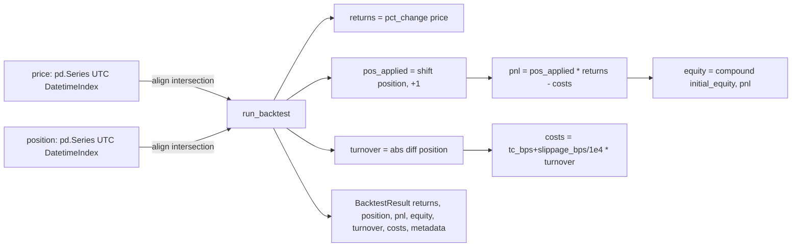

# Quant FX — Backtest (vectorized, no-lookahead)

Moteur de backtest **simple, déterministe et “next-bar”** pour évaluer des positions FX sur une série de prix, avec coûts (bps), turnover, PnL et equity curve.

## Badges

À compléter : badges CI/CD non détectés à partir du scope de ce dossier (ajouter une fois les workflows présents sous `.github/workflows/`).

## Table des matières

- [Aperçu / TL;DR](#aperçu--tldr)
- [Stack & Architecture](#stack--architecture)
  - [Tech Stack](#tech-stack)
  - [Arborescence](#arborescence)
  - [Patterns & principes](#patterns--principes)
- [Démarrage rapide](#démarrage-rapide)
- [Qualité & Sécurité](#qualité--sécurité)
- [Roadmap & Contribution](#roadmap--contribution)
- [Licence](#licence)
- [Crédits](#crédits)

## Aperçu / TL;DR

**Key features (orienté dev)**

- Backtest **vectorisé** : `returns`, `pnl`, `turnover`, `costs` sous forme de `pd.Series`.
- Exécution **next-bar** : `position[t-1]` est appliquée à `return[t]` (anti look-ahead par construction).
- Validation stricte : index **DatetimeIndex UTC**, monotone, unique ; `price > 0`, positions numériques.
- Coûts en **bps** (transaction + slippage) appliqués au **turnover**.
- Résultat typé : `BacktestResult` (series + `metadata`).



## Stack & Architecture

### Tech Stack

| Couche | Outils | Détails |
| --- | --- | --- |
| Backend (lib) | Python | Version : À compléter (voir packages/backend/pyproject.toml ou équivalent) |
| Data | pandas | pd.Series, alignement d’index, pct_change, diff |
| Tests | pytest | Tests unitaires sous packages/backend/tests/test_backtest.py |
| Typage | dataclasses | BacktestConfig, BacktestResult |

### Arborescence

```
packages/backend/src/quant_fx_system/quant/backtest/
├── __init__.py          # exports: BacktestConfig, BacktestResult, run_backtest
├── engine.py            # orchestration + PnL + equity
├── costs.py             # turnover + coûts (bps)
├── returns.py           # returns (simple: pct_change)
├── types.py             # dataclasses de config/result
└── validation.py        # garde-fous (UTC, monotonic, lookahead)
```

### Patterns & principes

Separation of concerns : calculs (returns/costs), orchestration (engine), invariants (validation), modèles (types).

No-lookahead explicite : shift d’un pas + validation d’alignement.

Interfaces simples : pd.Series in/out ; pas de dépendance infra.

## Démarrage rapide

### Prérequis

- Python : À compléter (référence attendue : packages/backend/pyproject.toml / requirements*.txt)
- Dépendances minimales : pandas (et numpy potentiellement au niveau repo)
- Runner tests : pytest

### Exemple d’utilisation

```python
import pandas as pd
from quant_fx_system.quant.backtest import BacktestConfig, run_backtest

# price: série de prix strictement positifs, index UTC, monotone et unique
# position: série de positions (ex: [-1, 1]), index UTC, monotone et unique

cfg = BacktestConfig(
    initial_equity=1.0,
    transaction_cost_bps=5.0,
    slippage_bps=2.0,
    max_leverage=1.0,
)

result = run_backtest(price=price, position=position, cfg=cfg)

result.returns   # returns[t] = price.pct_change()[t]
result.position  # position appliquée (shiftée), alignée sur returns
result.pnl       # pnl[t] = position[t-1] * returns[t] - costs[t]
result.equity    # equity curve (compounding)
```

### Lancer les tests (scope backtest)

Commande exacte à confirmer selon l’outillage du repo, mais les cibles existent :

```bash
# depuis la racine du repo
python -m pytest packages/backend/tests/test_backtest.py -q
```

## Qualité & Sécurité

Validation systématique :

- index DatetimeIndex UTC, monotone croissant, unique
- price sans NaN et strictement positif
- position numérique, sans NaN, bornée par max_leverage

Anti look-ahead :

- exécution “next bar” : position.shift(1) appliquée à returns
- contrôle via validate_no_lookahead_alignment(...)

Determinism :

- backtest purement fonctionnel sur entrées données (tests de déterminisme inclus)

## Roadmap & Contribution

### How to Contribute

- Modifier/ajouter une fonctionnalité dans packages/backend/src/quant_fx_system/quant/backtest/.
- Ajouter/mettre à jour les tests dans packages/backend/tests/test_backtest.py.
- Vérifier : pytest (et lint/format si configurés au niveau repo).

### Conventional Commits (recommandé)

- feat(backtest): ...
- fix(backtest): ...
- test(backtest): ...
- refactor(backtest): ...
- docs(backtest): ...

### Issue labels (suggestion)

backtest, bug, enhancement, breaking-change, good first issue

## Licence

Business Source License 1.1 (BSL 1.1).

## Crédits

Florian Mauduit.
