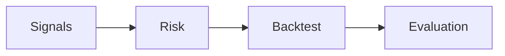

# Evaluation (Performance & Robustness)

## TL;DR
Le module `quant.evaluation` transforme des séries de backtest (returns, equity, positions, benchmark) en métriques auditables pour juger la performance et la robustesse d’une stratégie. Il produit un objet unique `EvaluationResult` contenant un résumé de métriques, des tables (rolling, percentiles) et des séries (equity, underwater).



## Usage rapide
```python
import pandas as pd
from quant_fx_system.quant.evaluation import EvaluationConfig, evaluate_strategy

index = pd.date_range("2024-01-01", periods=100, freq="D", tz="UTC")
returns = pd.Series(0.001, index=index)
benchmark = pd.Series(0.0005, index=index)

result = evaluate_strategy(
    returns=returns,
    benchmark_returns=benchmark,
    cfg=EvaluationConfig(risk_free_rate=0.02),
)

print(result.summary["sharpe"])
print(result.tables["rolling_metrics"].tail())
```

## Métriques principales
- Performance standard : total return, CAGR, vol, Sharpe, Sortino, Calmar, hit rate.
- Drawdowns : max drawdown, time under water, ulcer index, séries underwater.
- Distribution : skew, kurtosis (non-excess), excess_kurtosis, VaR/ES historiques, tail ratio, percentiles.
- Benchmark : tracking error, information ratio, alpha/beta, R².
- Robustesse : PSR, DSR, Sharpe ajusté autocorr, stabilité rolling SR.

## Notes quant importantes
- Convention “no lookahead” : si `position` est fourni, on suppose que la convention t-1 a déjà été respectée en amont. L’évaluation ne shift jamais les PnL.
- Annualisation : dépend de `periods_per_year` (inféré ou override). Si `annualization="none"`, les métriques restent non annualisées et `vol_annual` est un alias de la volatilité non annualisée (warning dans `metadata`).
