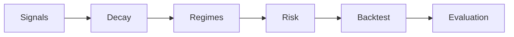

# quant.regimes — Market Regimes

## TL;DR
`quant.regimes` fournit des régimes de marché déterministes, causaux et auditables (volatilité, tendance, risk-on/off) pour EURUSD en daily, avec sorties prêtes à brancher dans le pipeline de signaux et de risk.



## Pourquoi ce module
Sans régime, les signaux sont fragiles, le sizing mal calibré et les backtests biaisés. `quant.regimes` propose :

- labels et probabilités de régimes,
- diagnostics (matrice de transition, durées),
- modes causaux et auditables.

## Causalité : filtering vs smoothing
- **filter (défaut)** : P(S_t | x_1..t) — causal, utilisable en live.
- **smooth** : P(S_t | x_1..T) — offline uniquement, interdit en live.
- **viterbi** : chemin offline le plus probable.

Si `mode in {"smooth", "viterbi"}`, un warning `offline_only` est ajouté dans `metadata`.

## Anti-lookahead
- Toutes les features sont calculées via `rolling` non centré.
- `feature_shift=1` par défaut : les features à t utilisent les données ≤ t-1.
- `output_shift=0` par défaut : le régime estimé à t est disponible à t.
- Pour appliquer le régime à t+1, utilisez `output_shift=1`.

## Exemple minimal
```python
import pandas as pd
from quant_fx_system.quant.regimes import RegimeConfig, infer_regimes

price = pd.Series(
    data=[1.1, 1.11, 1.09, 1.12],
    index=pd.date_range("2024-01-01", periods=4, tz="UTC"),
)

cfg = RegimeConfig(method="quantile_vol")
result = infer_regimes(price=price, cfg=cfg)

print(result.regime.tail())
print(result.proba.tail())
```

## Brancher dans le risk overlay
Exemple d’usage : réduire le leverage quand la volatilité est élevée.

```python
if result.regime.iloc[-1] == 2:  # HIGH_VOL
    leverage = min(leverage, 0.5)
```

## Notes académiques
- Régimes = variable latente (Markov chain vs HMM).
- Filtering vs smoothing vs Viterbi.
- Volatility clustering et realised volatility.
- Matrices de transition, persistance, durées.
- Régime-dependent performance (Sharpe conditionnel).
- EM/Baum-Welch + régularisation (variance minimale).
- Change-point detection (CUSUM) pour ruptures.

## Méthodes disponibles
- `quantile_vol` : buckets de volatilité (stable, déterministe).
- `trend_range` : tendance vs range (slope + R²).
- `hmm_gaussian` : HMM Gaussien diagonal (EM causal).
- `cusum` : détection de ruptures (flags).
