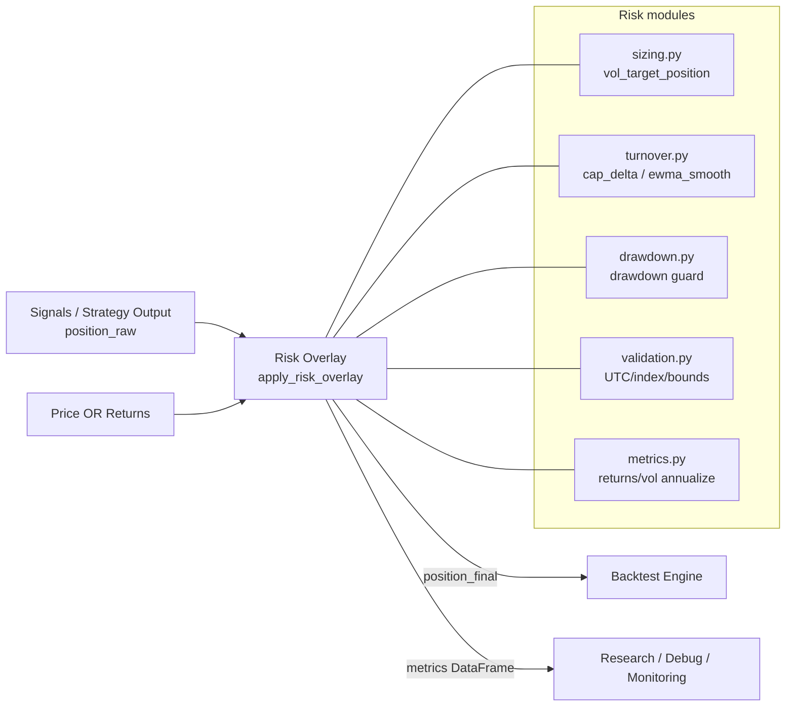

# quant_fx_system · Risk Overlay

**Risk management overlay** (vol targeting, turnover control, drawdown guard) pour transformer une position “raw” en position **tradable** et **bornée**, sans lookahead.

<!-- Badges : à compléter au niveau repo root si des workflows GitHub Actions / coverage / docker image existent. -->

## Table des matières
- [Aperçu / TL;DR](#aperçu--tldr)
- [Stack & Architecture](#stack--architecture)
  - [Tech Stack](#tech-stack)
  - [Arborescence](#arborescence)
  - [Principes](#principes)
- [Démarrage rapide](#démarrage-rapide)
- [Configuration](#configuration)
- [API](#api)
- [Qualité & Sécurité](#qualité--sécurité)
- [Roadmap & Contribution](#roadmap--contribution)
- [Licence](#licence)
- [Crédits](#crédits)

## Aperçu / TL;DR

### Key features
- **Pipeline risk end-to-end** via `apply_risk_overlay(...)` : `raw → vol target → turnover control → drawdown guard → clip`.
- **Invariants stricts d’index** : `DatetimeIndex`, timezone-aware **UTC**, monotonic, unique (validation centralisée).
- **No lookahead par design** : sizing basé sur métriques rolling avec `shift` explicite (ex. vol targeting), equity/drawdown calculés avec position décalée.
- **Audit-friendly** : retour d’un `RiskResult` avec `position` finale + `metrics` détaillées (vol, scale, turnover, drawdown…).
- **Composable** : modules séparés (sizing / turnover / drawdown / metrics / validation / types).



## Stack & Architecture

### Tech Stack

| Couche | Outils | Détails |
| --- | --- | --- |
| Runtime | Python | À compléter (voir manifest du backend : packages/backend/pyproject.toml si présent) |
| Data | pandas, numpy | Séries temporelles (UTC), rolling stats, vectorisation + boucles ciblées |
| Tests | pytest | Tests dédiés : packages/backend/tests/test_risk.py |

### Arborescence

Chemin : packages/backend/src/quant_fx_system/quant/risk/

```
risk/
  __init__.py          # exports publics
  overlay.py           # pipeline principal apply_risk_overlay
  types.py             # RiskConfig + sous-configs (vol/drawdown/turnover/var_es)
  validation.py        # invariants d’index + bounds + utilitaires d’alignement
  metrics.py           # returns + vol rolling + annualisation (auto)
  sizing.py            # vol targeting (scale + shift)
  turnover.py          # turnover + cap delta + EWMA smoothing
  drawdown.py          # equity proxy + drawdown + guard + cooldown
  var_es.py            # helpers VaR/ES historiques (rolling)
```

### Principes

- **Pure functions** : entrées pandas → sorties pandas (facile à tester, facile à auditer).
- **Validation explicite** : index UTC + monotonic + unique, valeurs finies, bornes leverage.
- **No lookahead** : toute métrique de risque utilisée pour agir sur la position peut être shiftée (ex. VolTargetConfig.shift).
- **Compatibilité backtest** : la convention “position[t-1] appliquée à return[t]” est conservée (cf. equity proxy en drawdown).

## Démarrage rapide

### Prérequis

- Python : À compléter (se référer au manifest du backend : packages/backend/pyproject.toml ou équivalent).
- Dépendances runtime : pandas, numpy
- Tests : pytest

### Lancer les tests du module

Depuis la racine du repo :

```bash
python -m pytest packages/backend/tests/test_risk.py
```

### Exemple d’usage minimal

```python
import pandas as pd
from quant_fx_system.quant.risk import RiskConfig, apply_risk_overlay

idx = pd.date_range("2024-01-01", periods=10, freq="D", tz="UTC")

position_raw = pd.Series([0, 1, 1, -1, 0.5, 0, 0.2, 0.2, 0, 0], index=idx, name="pos_raw")
price = pd.Series([1.00, 1.02, 1.01, 1.03, 1.05, 1.04, 1.06, 1.07, 1.06, 1.08], index=idx, name="price")

cfg = RiskConfig(max_leverage=1.0)
result = apply_risk_overlay(position_raw=position_raw, price=price, cfg=cfg)

position_final = result.position          # pd.Series
metrics = result.metrics                 # pd.DataFrame (debug/audit)
```

## Configuration

### RiskConfig (entrée principale)

Le module est configuré via dataclasses dans types.py.

- `max_leverage` : borne finale appliquée sur `position_final`.
- `vol_target` : sizing par volatilité (rolling + annualisation optionnelle + shift anti-lookahead).
- `turnover` : contrôle de turnover (cap du delta ou EWMA smoothing).
- `drawdown` : guard drawdown (flatten ou delever) + cooldown.
- `var_es` : configuration VaR/ES (helpers disponibles via var_es.py).

### Variables d’environnement

Aucune : le module est pur Python (pas d’IO, pas de secrets, pas de config runtime via .env).

## API

### Public exports

Déclarés dans __init__.py :

- `apply_risk_overlay(...)`
- `RiskConfig`, `RiskResult`

### apply_risk_overlay

Fichier : overlay.py

Signature (résumé) :

- `position_raw`: pd.Series (requis)
- `price`: pd.Series | None (optionnel)
- `returns`: pd.Series | None (optionnel)
- `cfg`: RiskConfig (requis)
- `initial_equity`: float = 1.0

Règles d’entrée (enforced par validation) :

- Index DatetimeIndex UTC, monotonic, unique
- `price` strictement positif si fourni
- `position_raw` borné ensuite par `max_leverage` (clip final)
- Alignement par intersection d’index (`align_series(...)`)

Sortie :

- `RiskResult.position` : position_final (NaN → 0, clip leverage)
- `RiskResult.metrics` : DataFrame de métriques intermédiaires (vol, scale, turnover, equity proxy, drawdown…)
- `RiskResult.metadata` : dict (actuellement vide par défaut)

### Modules internes (référence rapide)

- Sizing vol : sizing.py → `vol_target_position(...)`
- Turnover : turnover.py → `cap_position_delta(...)`, `ewma_smooth_position(...)`
- Drawdown : drawdown.py → `apply_drawdown_guard(...)`
- VaR/ES : var_es.py → `historical_var(...)`, `historical_es(...)`
- Validation : validation.py

## Qualité & Sécurité

### Tests

Tests unitaires : packages/backend/tests/test_risk.py

- invariants d’index UTC
- vol targeting (régimes + no lookahead via shift)
- drawdown guard (flatten)
- turnover cap
- métriques attendues (colonnes minimales)

### Sécurité

- Pas de secrets / pas d’IO / pas de dépendances réseau.
- Validation stricte des indices et des bornes pour éviter les sorties silencieusement corrompues.

## Roadmap & Contribution

### How to Contribute

- PR petites et atomiques.
- Ajoute/étends les tests (packages/backend/tests/test_risk.py) pour toute nouvelle logique.
- Toute nouvelle métrique de risque doit expliciter sa convention lookahead/shift.

### Conventional Commits

- `feat(risk): ...`
- `fix(risk): ...`
- `test(risk): ...`
- `refactor(risk): ...`

### Issue labels (suggestion)

risk, quant, backtest, bug, enhancement, breaking-change

## Licence

Business Source License 1.1 (BSL 1.1) — voir le fichier LICENSE.

## Crédits

Florian Mauduit
